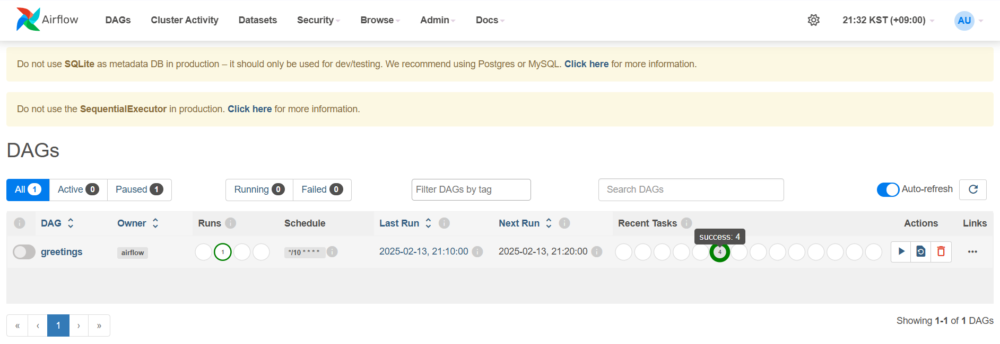
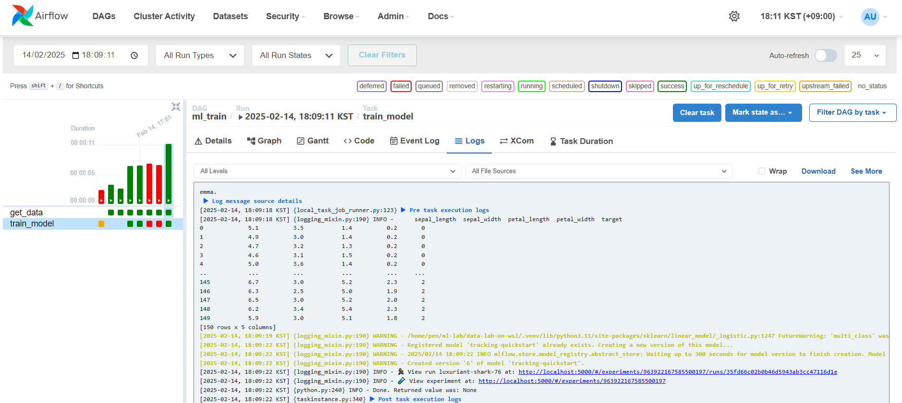
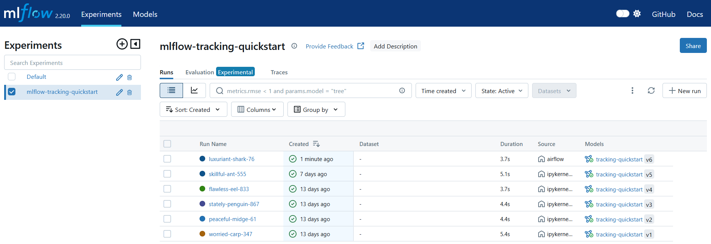

# Airflow on WSL
## Examples
### MLOps with MLflow and Airflow
MLflow excels at managing the machine learning lifecycle, including experiment tracking, model management, and serving. However, it doesn't provide powerful features for workflow management and automation and ideal capabilities for orchestrating complex data pipelines. Apache Airflow, on the other hand, is an open-source platform for developing, scheduling, and monitoring batch-oriented workflows. Airflow’s extensible Python framework enables you to build workflows connecting with virtually any technology. A web interface helps manage the state of your workflows. MLflow and Airflow are two pivotal tools in the MLOps ecosystem, each serving distinct purposes that complement one another when integrated. In this example, we will learn how to integrate Airflow and MLflow for automatic ML lifecycle management.

#### Access Airflow
Press `ctrl+c` to stop the Airflow. And Open the Airflow configuration file `$HOME/airflow/airflow.cfg` (or if you customized your Airflow home directory, open the `$AIRFLOW_HOME/airflow.cfg`) to turn off default example loading: `load_examples = False`.

Alos, you can override default configurations using environment variables, see [Configuration Reference](https://airflow.apache.org/docs/apache-airflow/stable/configurations-ref.html). You can inspect the file either in `$AIRFLOW_HOME/airflow.cfg`, or through the UI in the `Admin > Configuration` menu.

Restart Airflow standalone: `airflow standalone`. Visit `localhost:8080` in your browser and log in with the admin account details (user name and automatically generated password) shown in the terminal.

Once logged in, go to the *Cluster Activity*, and verify your Airflow standalone cluster is healty.


You may see an error message on the *Cluster Activity*. This could be due to insufficient available memory. Please make sure your system has enough free memory (recommended minimum memory is 4GB) and restart your Airflow standalone cluster.
```
The scheduler does not appear to be running. Last heartbeat was received a few seconds ago.
The DAGs list may not update, and new tasks will not be scheduled.
```

#### Workflow Management with DAG(Directed Acyclic Graph)
A [DAG](https://airflow.apache.org/docs/apache-airflow/stable/core-concepts/dags.html) is the core concept of Airflow, collecting Tasks together, organized with dependencies and relationships to say how they should run. This DAG file repository is configured as `dags_folder` variable in the `airflow.cfg` file and the default path is `~/airflow/dags` (same as `$HOME/airflow/dags`). Copy the dags directory from the cloned repository into the Airflow home direcotry.
```
cp -r data-lab-on-wsl/examples/airflow/dags $HOME/airflow/
```

You will see the `greetings` and `ml_train` in the *DAGs* when you back to the Airflow. With these DAGs, you can see how Airflow works and how to integrate Airflow and MLflow for ML workflow management. Go to the *DAGs* and run what you want.



> [!IMPORTANT]
> Please make sure that your MLflow Tracking Server is running before you run the MLOps with Airflow and MLflow DAG. For more information how to run a MLflow Tracking Server, follow the [Install MLflow](../jupyter/README.md#install-mlflow) instructions.

If the ML pipeline was successfully finished, you can see the a new experiment has been recorded in MLflow Tracking Server. Access `localhost:5000` to see the latest experiment *airflow* registred as the source.


# Additional Resources
- [Terraform: Data on Amazon EKS](https://github.com/Young-ook/terraform-aws-eks/tree/main/examples/data-ai)

# References
- [Installation of Airflow](https://airflow.apache.org/docs/apache-airflow/stable/installation/index.html)
- [Airflow Production Deployment](https://airflow.apache.org/docs/apache-airflow/stable/administration-and-deployment/production-deployment.html)
