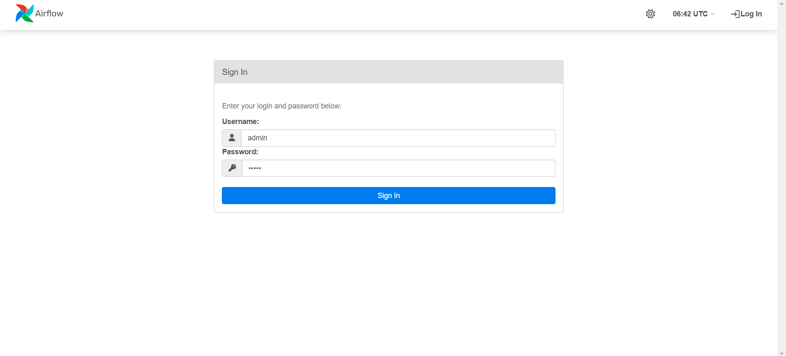
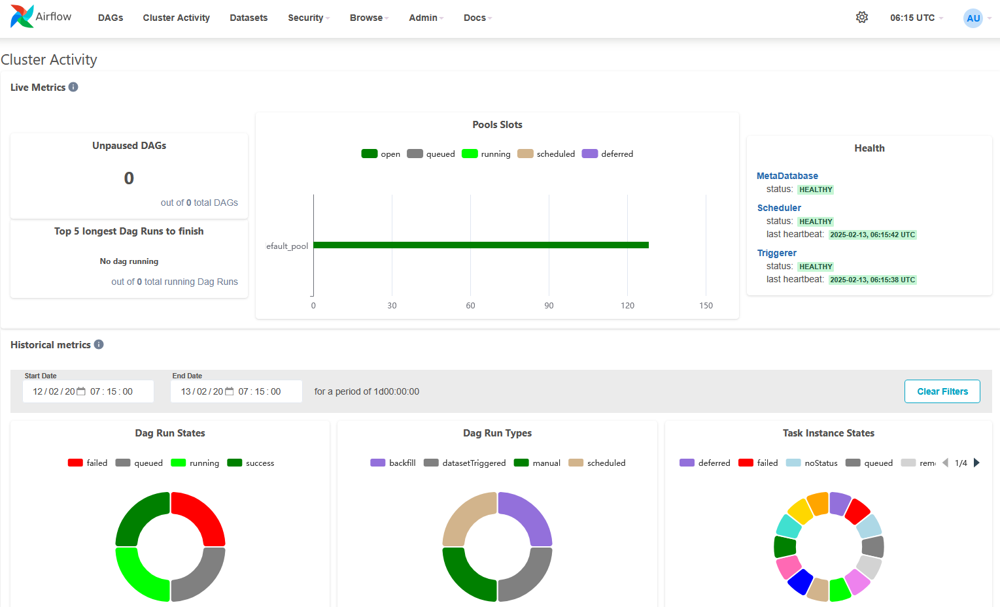

# Airflow on WSL
## Examples
### MLOps with MLflow and Airflow
MLflow excels at managing the machine learning lifecycle, including experiment tracking, model management, and serving. However, it doesn't provide powerful features for workflow management and automation and ideal capabilities for orchestrating complex data pipelines. Apache Airflow, on the other hand, is an open-source platform for developing, scheduling, and monitoring batch-oriented workflows. Airflow’s extensible Python framework enables you to build workflows connecting with virtually any technology. A web interface helps manage the state of your workflows. MLflow and Airflow are two pivotal tools in the MLOps ecosystem, each serving distinct purposes that complement one another when integrated. In this example, we will learn how to integrate Airflow and MLflow for automatic ML lifecycle management.

#### Access Airflow
Visit `localhost:8080` in your browser and log in with the admin account details (user name and automatically generated password) shown in the terminal.



Go to the *Cluster Activity*, and verify your Airflow standalone cluster is healty.


You may see an error message on the *Cluster Activity*. This could be due to insufficient available memory. Please make sure your system has enough free memory (recommended minimum memory is 4GB) and restart your Airflow standalone cluster.
```
The scheduler does not appear to be running. Last heartbeat was received a few seconds ago.
The DAGs list may not update, and new tasks will not be scheduled.
```

#### Simple DAG
Create a new directory to save the user created DAG file. This DAGs file repository is configured as `dags_folder` variable in the `airflow.cfg` file and the default path is `$HOME/airflow/dags`.
```
mkdir -p ~/airflow/dags   # or $HOME/airflow/dags
```

And, copy the example DAG file into the direcotry. You will see the `greetings` in *DAGs* when you back to the Airflow.
```
cp data-lab-on-wsl/examples/airflow/dags/greeting_dag.py ~/airflow/dags/
```

# Additional Resources

# References
- [Installation of Airflow](https://airflow.apache.org/docs/apache-airflow/stable/installation/index.html)
