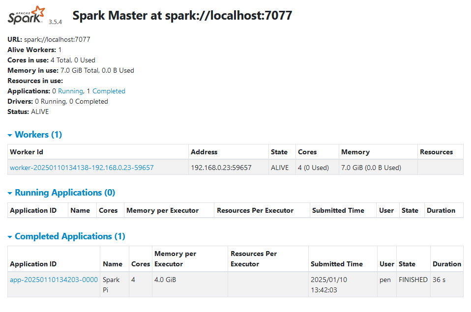
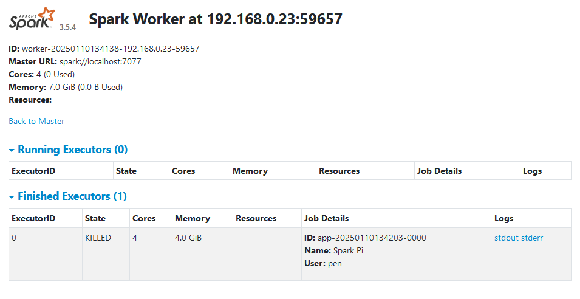
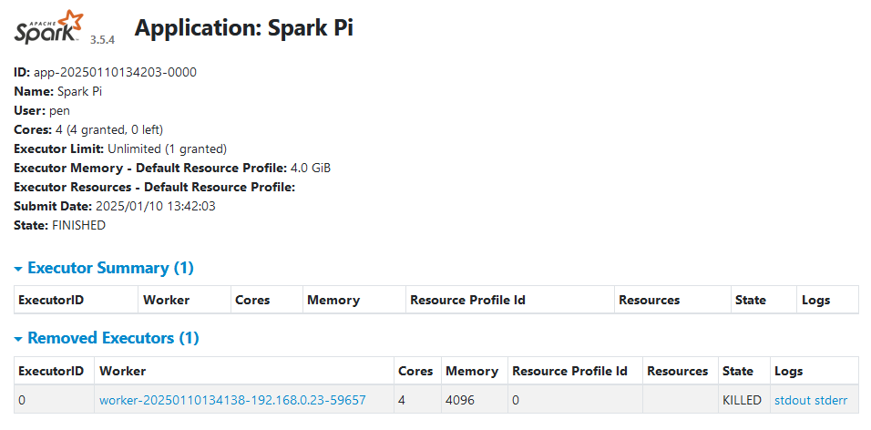

# Spark on WSL
Environment:
- Debian 12 (Bookworm)
- OpenJDK 11 (or Amazon Corretto 11)
- Spark 3.5.4

## Install Java
Install OpenJDK 11

## Install Spark
Download the binary package file.
```
wget https://dlcdn.apache.org/spark/spark-3.5.4/spark-3.5.4-bin-hadoop3.tgz
```
Or you can download using curl if you don't have wget.
```
curl -O https://dlcdn.apache.org/spark/spark-3.5.4/spark-3.5.4-bin-hadoop3.tgz
```
Set environment variable to the current spark runtime.
```
# set SPARK_HOME directory
export SPARK_HOME="$HOME/.local/lib/spark-3.5.4-bin-hadoop3"
```

## Run Spark Examples
### Local Machine
Simply, you can run your spark Pi caculation application on your local machine.
```
bash spark-pi-local.sh
```


### Standalone Cluster
Or, if you want to run your spark Pi application, you need to run spark standalone cluster. then, you can run the application on your cluster.
```
bash spark-standalone.sh -r
bash spark-pi-standalone.sh
```






You can stop and terminate your spark standalone cluster after your spark job is finished.
```
bash spark-standalone.sh -t
```

# Additional Resources

# References
- [Spark Standalone Mode](https://spark.apache.org/docs/latest/spark-standalone.html)
- [Submitting Spark Applications](https://spark.apache.org/docs/latest/submitting-applications.html)
