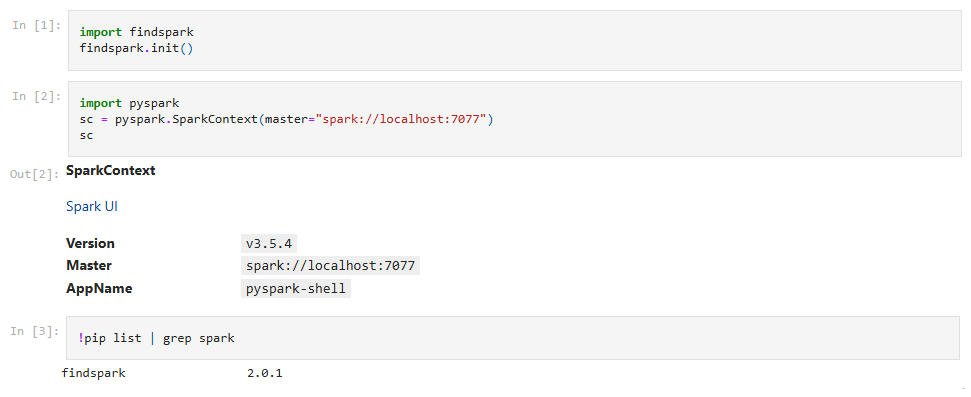

# Spark on WSL
## Run Spark Examples
### Jupyter with Standalone Cluster
Open the `init-pyspark.ipynb` file in the jupyter notebook.


### Local Machine
Simply, you can run your spark Pi caculation application on your local machine.
```
bash spark-pi-local.sh
```


### Standalone Cluster
Or, you can run your spark Pi application on your local standalone cluster. You can skip to launch standalone cluster if your cluster is already running. Then, submit the standalone spark Pi job into your local cluster.
```
sh spark-ctl.sh -r
bash spark-pi-standalone.sh
```


# Additional Resources

# References
- [Spark Standalone Mode](https://spark.apache.org/docs/latest/spark-standalone.html)
- [Submitting Spark Applications](https://spark.apache.org/docs/latest/submitting-applications.html)