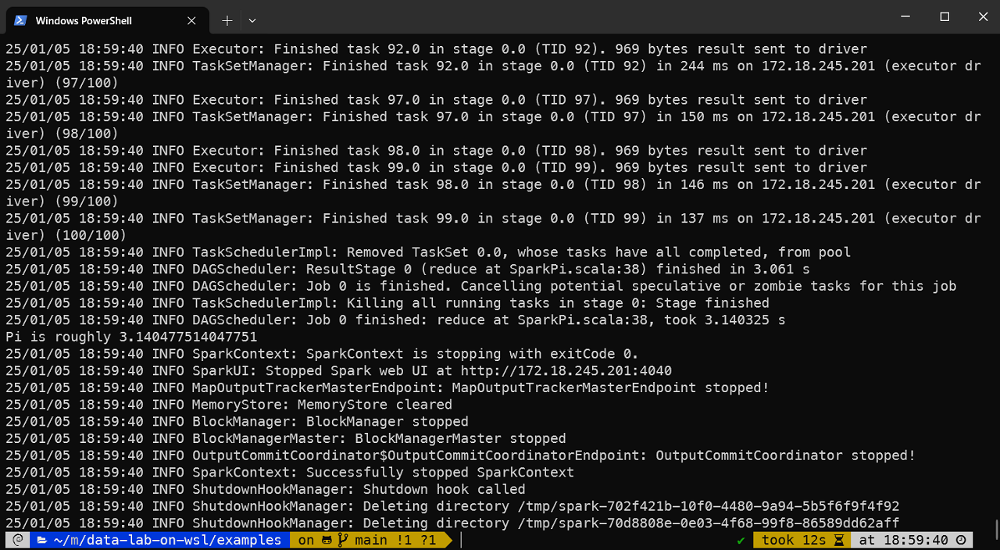
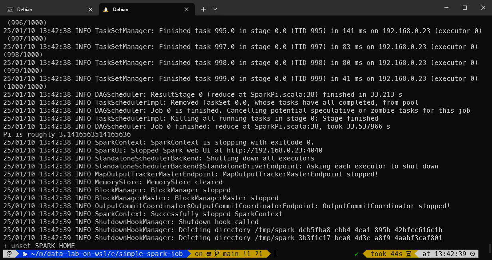

# Apache Spark

## Spark Architecture
Apache Spark architecture consists of a driver program that coordinates tasks and interacts with a cluster manager to allocate resources. The driver communicates with worker nodes, where tasks are executed within an executor’s JVM. SparkContext manages the execution environment, while the DataFrame API enables high-level abstraction for data manipulation. SparkSession provides a unified entry point for Spark functionality. Underneath, the cluster manager oversees resource allocation and task scheduling across nodes, facilitating parallel computation for processing large-scale data efficiently.


Spark applications run as independent sets of processes on a cluster, coordinated by the SparkContext object in your main program (called the driver program). Specifically, to run on a cluster, the SparkContext can connect to several types of cluster managers (either Spark’s own standalone cluster manager, Mesos, YARN or Kubernetes), which allocate resources across applications. Once connected, Spark acquires executors on nodes in the cluster, which are processes that run computations and store data for your application. Next, it sends your application code (defined by JAR or Python files passed to SparkContext) to the executors. Finally, SparkContext sends tasks to the executors to run.

## Setup
### Install Java
For Apache Spark, we need to install apache spark application. The runtime environment is OpenJDK 11 (or Amazon Corretto 11) on Debian 12 linux. The first step is installing java. The default JDK for Debian 12 is OpenJDK 11, and follow the instructions to install OpenJDK 11.
```
sudo apt install default-jdk
```
Or, you can use Amazon Corretto
```
curl -LO https://corretto.aws/downloads/latest/amazon-corretto-11-x64-linux-jdk.deb
sudo apt install java-common && sudo dpkg -i amazon-corretto-11-x64-linux-jdk.deb
```

If you have installed the multiple java runtimes, you can switch to the java runtime you want using `update-alternatives` command.
```
sudo update-alternatives java

*+  1   /usr/lib/jvm/java-7-openjdk-amd64/bin/java
    2   /usr/lib/jvm/java-8-openjdk-amd64/bin/java

Enter to keep the current selection[+], or type selection number:
```

### Install Spark
After install java, you need to install spark. The spark version we will use for this example is 3.5.4. Download the binary package file:
```
wget https://dlcdn.apache.org/spark/spark-3.5.4/spark-3.5.4-bin-hadoop3.tgz
```
Or you can download using curl if you don't have wget.
```
curl -O https://dlcdn.apache.org/spark/spark-3.5.4/spark-3.5.4-bin-hadoop3.tgz
```

And move the extracted directory where you want to install. In this example, we will install spark under the *$HOME/.local/lib/*. If you finished to move the file, you have to set system environment variable to the current spark runtime:
```
export SPARK_HOME="$HOME/.local/lib/spark-3.5.4-bin-hadoop3"
```

To set the environment variables permanently, add the script below to your profile *$HOME/.profile* (if zsh, *$HOME/.zprofile*).
```
# It is required to set the SPARK_HOME environment variable.
# Please make sure the variable indicates to the right path to your spark.
if [ -z $SPARK_HOME ] ; then
  export SPARK_HOME="$HOME/.local/lib/spark-3.5.4-bin-hadoop3"
fi
```

For compatibility, you can also define environment variable settings in your *$HOME/.profile* and set zsh to emulate sh-mode in effect.
```
[[ -e ~/.profile ]] && emulate sh -c 'source ~/.profile'
```

## Spark Application Examples

### Pi on Local Machine
Simply, you can run your spark Pi caculation application on your local machine:
```bash
sh job-submit-pi.sh -l
```



## Pi on Standalone Cluster
You can also run your spark Pi caculation application on your local standalone cluster. To run an application on standalone cluster, you need to make sure that your standalone spark cluster is running. Run your local standalone spark cluster:
```bash
# run a spark standalone cluster
sh sparkctl.sh -r
```

And, submit spark Pi application to the your local cluster:
```bash
sh job-submit-pi.sh -s
```




### Clean up
```bash
# terminate the running spark standalone cluster
sh sparkctl.sh -t
```

# Next Step
- [PySpark](../analytics-lab.md#pyspark)
