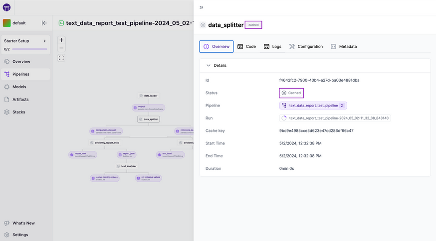
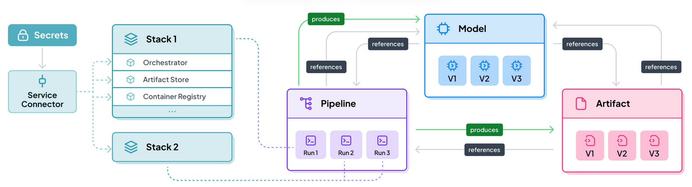

# ML (Machine Learning) Lab

## Table of Contents
- [ML Basic](#ml-basic)
- [MLOps](#mlops)
- [LLM (Large Language Model)](#llm)
- [Other Examples](#other-examples)

## ML Basic
Open the notebooks in the *mlbasic* directory and follow the instructions.
- `dataset.ipynb`
- `feature-engineering.ipynb`

## MLOps
### MLflow
Open the `mlflow.ipynb` notebook in the *mlops* directory and follow the instructions. And if you are looking for the latest examples and advanced guide for MLflow, you can follow the instructions from [the official MLflow repository](https://github.com/mlflow/mlflow). Clone the mlflow into the *data-lab-on-wsl/labs/extra* directory and run examples by following the intructions of each jupyter notebooks under the example directory. You should make a *extra* directory where to clone the mlflow examples if you don't have it on your workspace.
```bash
git clone https://github.com/mlflow/mlflow.git
```


### Airflow
Open the [airflow.md](mlops/airflow.md) file in the *mlops* directory and follow the instructions.

### Kedro
Kedro is an open-source Python framework to create reproducible, maintainable, and modular data science code. It uses software engineering best practices to help you build production-ready data science pipelines. You can build your MLOps pipeline by following the official [Kedro Tutorial](https://docs.kedro.org/en/stable/tutorial/spaceflights_tutorial.html).


### ZenML
ZenML is an open-source MLOps framework that seamlessly integrates existing infrastructure and tools. You can launch and test a ZenML yourself and take a tour with the guided [Quick Start](https://github.com/zenml-io/zenml/tree/main/examples/quickstart). And if you want to learn more details of ZenML for ML lifecycle management, you can look into the [ZenML](https://github.com/zenml-io/zenml) guide.




## LLM
### Simple LLM
Open the `simple-llm-student-guide.ipynb` notebook in *llm* directory and follow the instructions.

## Other Examples
### PyTorch for Deep Learning Bootcamp
Clone the repository into the *data-lab-on-wsl/labs/extra* directory. If you have the *extra* directory you can create before you clone the repository using `mkdir -p extra`. To run hands-on labs, open each notebooks and follow the tutorials for pytorch deep learning course. For more details, please check out the [PyTorch for Deep Learning Bootcamp](https://github.com/mrdbourke/pytorch-deep-learning).

**NOTE** Make sure to clone the repository via SSH, not HTTP. Due to the large file size, you might see a gRPC error when you try to download the project over HTTP.
```
git clone git@github.com:mrdbourke/pytorch-deep-learning.git
```

**NOTE** This example requires some packages such as *pytorch*. Please make sure to install these packages using PyPI or conda if you don't have before you run examples. For more details, please refer to the [PyTorch website](https://pytorch.org).
```
pip3 install torch torchvision torchaudio
```


### Randy Olson's Data Analysis and Machine Learning projects
This is a good project for learning data analysis and machine learning with hand-on. To run examples, clone the repository under the *data-lab-on-wsl/labs/extra* directory. Please create *extra* directory if you don't have. Open and follow the instructions of each notebooks. For more details, please check out the [Data Analysis and Machine Learning Projects](https://github.com/rhiever/Data-Analysis-and-Machine-Learning-Projects).

```
git clone https://github.com/rhiever/Data-Analysis-and-Machine-Learning-Projects.git
```

**NOTE** This example requires some packages such as *numpy, pandas, scikit-learn, matplotlib, seaborn, watermark*. Please make sure to install these packages using pip or conda if you don't have before you run examples.
```
pip install numpy pandas scikit-learn matplotlib seaborn watermark
```


# Additional Resources
- [Linux Foundation AI/Data Projects](https://lfaidata.foundation/projects/)
- [PyTorch Tutorials](https://pytorch.org/tutorials/)
- [Tensorflow Tutorials](https://www.tensorflow.org/tutorials)
- [Kubeflow](https://www.kubeflow.org/)
- [MLflow](https://mlflow.org/)
- [Polyaxon](https://polyaxon.com/)
- [ZenML](https://www.zenml.io/)
